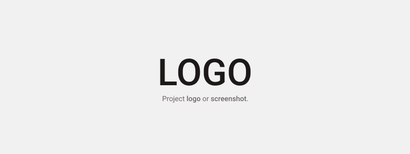

# Project Name

### A simple description of the project. A simple git project README.md template.

<a href="http://" target="_blank"></a>


A detailed description of the project. This is a simple readme template to get you started in your projects, you can modify and use it according to your needs.

## Browsers support

| <br>Chrome | <br>Firefox | <br>Edge | <br>Safari | <br>Opera |
| :-------------------------------------------------------------------: | :---------------------------------------------------------------------: | :---------------------------------------------------------------: | :-------------------------------------------------------------------: | :-----------------------------------------------------------------: |
|                                  57+                                  |                                   52+                                   |                                16+                                |                                 10.1+                                 |                                 44+                                 |

(Notice: I'm using the version numbers based on the CSS Grid browser support from [caniuse](http://www.caniuse.com) as a starting point.)

## Features

A few things that you can do with {project_name}:

- Simple and easy to use
- Clean design
- To the point
- Customizable

## Design & Prototype

- [Design](http://)
- [Prototype](http://)

## Development

### Clone Code

```bash
git clone https://github.com/takebo/git-readme-template.git
```

### Install Dependencies

```bash
cd git-readme-template
npm install
```

### Dev Mode

```bash
npm start
```

### Testing

```bash
npm test
```

### Build Release

```bash
npm run build
```

After building, the application will be found in the project's `build` directory.

## Technology Stack

- [React](https://reactjs.org/)
- [Create React App](https://github.com/facebook/create-react-app)
- [React Native](https://facebook.github.io/react-native/)
- [Angular](https://angular.io/)
- [Flutter](https://flutter.dev/)
- [Vue](https://vuejs.org/)
- [Electron](https://electronjs.org/)
- [Axios](https://github.com/axios/axios)
- [Sass](https://github.com/sass/node-sass)
- [Redux](https://redux.js.org/)
- [Jest](https://jestjs.io/)
- [Enzyme](https://airbnb.io/enzyme/)

## Todo

- [x] Clone this repo
- [ ] Modify the content
- [ ] Create a logo or take a screenshot of your project
- [ ] Commit changes

## Credits and References

- Most of the ideas of this template came from checking various projects listed in Trending repositories here at [Github](https://github.com/trending).

## License

{project_name} is [MIT](LICENSE) licensed.
